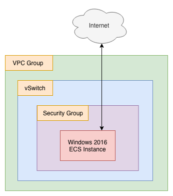

# Chrome On Windows

## What

This ROS script sets up a Windows Server 2016, and then uses a PowerShell script (encoded in Base64 format) to automatically fetch and install the Chrome browser. The script also sets up security group rules that allow RDP inbound to the ECS instance. If you have ever needed a remote desktop for testing purposes, this is a quick and easy way to set one up. The PowerShell script comes from [here](https://medium.com/@uqualio/how-to-install-chrome-on-windows-with-powershell-290e7346271). 

Once the script has run, it outputs login information, so that you can log into the newly created ECS instance using an RDP client.

Directory contents:

```
.
├── README.md
├── chrome-on-windows.json
├── diagrams
│   ├── chrome_on_windows.png
│   └── chrome_on_windows.xml
├── install_chrome.b64
└── install_chrome.ps1
```

The readme and diagrams (done using [draw.io](https://about.draw.io/)) are here for explanatory purposes.

## Why

Sometimes, you just need a remote desktop session somewhere else. Maybe for testing connectivity or load times for a website or application. And IE on Windows Server 2016 is painful to use, so you want Chrome.

## How

Copy paste the contents of `chrome-on-windows.json` into the template creation dialog in the Alibaba Cloud ROS console. Save your new template. To the right of the new template, click on "Create Stack". This will start in motion the process of creating a new VPC group, vSwitch, and ECS instance using the resources and properties defined in `chrome-on-windows.json`. Once the process is complete, you should see a new ECS instance show up in the ECS console, in the region you specified when creating the stack. That's it! You can now RDP into the instance using its public IP address.

## Architecture

The "architecture" for this system is as follows:



The architecture is very simple. Only a single ECS instance, vSwitch, security group, and VPC group are created.